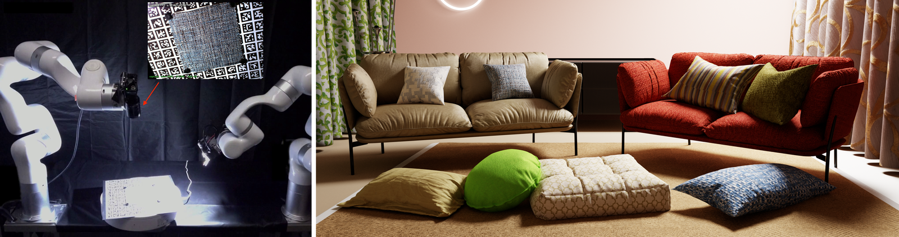
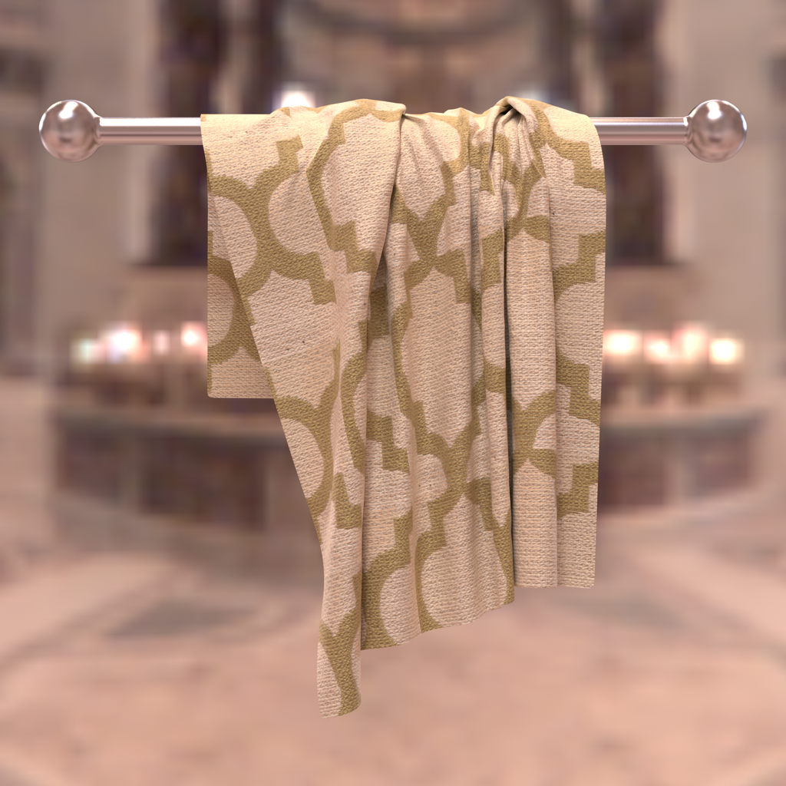

# RoboCloth

**500 real cloth materials, captured robotically and reconstructed as neural
BRDFs ready to use as online or offline shaders (Mitsuba 3 integration
included).**

Code, models and data for the paper *RoboCloth: A Large-Scale Real Cloth
Material Dataset for Neural Reflectance Reconstruction*.

<!-- PUBLIC-ONLY:BEGIN -->
[](https://colinzhenli.github.io/BRDF-Fipt/)
[](https://huggingface.co/datasets/koalapenguin/RoboCloth)
[](https://huggingface.co/datasets/koalapenguin/RoboCloth-assets)

Anonymous authors — paper under review.
<!-- PUBLIC-ONLY:END -->



*Left: the capture rig — two robot arms carry the camera and an LED light
over a turntable; the inset is one captured frame. Right: held-out materials
fitted with our learned prior and path-traced as the sofa, curtain, pillow
and carpet fabrics (paper Fig. 1).*

RoboCloth is a dataset of 500 real cloth materials, each imaged in about 580
HDR frames under robotically controlled, calibrated camera and light
configurations. Every material ships with SfM-refined camera poses aligned to
the robot frame, sparse surface geometry and structured per-point reflectance
observations. A two-stage pipeline turns captures into renderable materials:
Stage 1 trains one MLP BRDF decoder on the corpus as a cloth prior; Stage 2
freezes it and fits a dense 2048×2048 latent texture to each material. With
this repository you can render the released materials in your own Mitsuba 3
scenes, fit new materials with the pretrained decoder, retrain the decoder,
and reproduce the paper's tables and figures.

This README shows the main application — **rendering our materials on your
own scene**. The other entry points each have their own guide:

| I want to... | Guide |
|---|---|
| Optimize a new material from our dataset (with the pretrained decoder) | [docs/optimize_new_material.md](docs/optimize_new_material.md) |
| Train the shared BRDF decoder from scratch | [docs/train_decoder.md](docs/train_decoder.md) |
| Reproduce the paper's numbers and figures | [docs/reproduce_paper.md](docs/reproduce_paper.md) |
| Understand how the dataset was captured (calibration + reconstruction) | [docs/capture_pipeline.md](docs/capture_pipeline.md) |

Released data: capture dataset at
[koalapenguin/RoboCloth](https://huggingface.co/datasets/koalapenguin/RoboCloth),
checkpoints + render assets at
[koalapenguin/RoboCloth-assets](https://huggingface.co/datasets/koalapenguin/RoboCloth-assets).

## Render our materials on your scene

### 1. Environment

```bash
conda create -n robocloth-render -c conda-forge python=3.11 -y && conda activate robocloth-render
pip install torch==2.4.1 torchvision==0.19.1 --index-url https://download.pytorch.org/whl/cu121
pip install -r envs/rendering.txt
```

### 2. Get checkpoints

Choose an absolute download directory. The commands below and all later path
examples intentionally use absolute paths so changing into `rendering/` does
not change what they resolve to.

```bash
export ROBOCLOTH_REPO=/absolute/path/to/RoboCloth
export ROBOCLOTH_CKPTS=/absolute/path/to/robocloth-checkpoints
hf download koalapenguin/RoboCloth-assets --repo-type dataset \
    --include "checkpoints/stage2/RoboCloth/*" --local-dir "$ROBOCLOTH_CKPTS"
```

Any of the released stage-2 checkpoints is a complete material (a latent
texture + decoder); checkpoints you optimize yourself
([guide](docs/optimize_new_material.md)) work identically.

### 3. Describe your scene

A renderable scene is a folder:

```
my_scene/
├── scene.xml        # ordinary Mitsuba 3 scene; shapes carry ids
├── meshes/…         # UV-mapped geometry referenced by the XML
└── materials.json   # which shapes get which material
```

```json
{
  "checkpoint_root": "/absolute/path/to/robocloth-checkpoints/checkpoints/stage2/RoboCloth",
  "assignments": {
    "sofa":    {"material": "370"},
    "curtain": {"material": "145", "uv_tiling": 12.0}
  }
}
```

Shapes not listed keep their XML BSDF. Meshes must have UVs (the material is
a latent *texture*) — if yours don't, generate them with
`blender --background --python rendering/tools/generate_uv.py -- your_mesh.obj`
(headless-Blender Smart-UV with any Blender ≥ 3.6, or the `bpy` wheel under
Python 3.11 — see [docs/uv_tool.md](docs/uv_tool.md); OBJ/PLY/GLB/glTF in,
a triangulated `your_mesh_uv.ply` out — ready for `render.py` — and the input
is never modified), and use `uv_tiling` to set the weave repeat density. Full
`materials.json` reference: [rendering/README.md](rendering/README.md).

### 4. Render

```bash
cd "$ROBOCLOTH_REPO/rendering"
python render.py scene=/absolute/path/to/my_scene \
    output_base=/absolute/path/to/render-output output_name=my_render
```

Quality and output settings (spp, resolution, tone mapping, path depth) live
in [rendering/configs/render.yaml](rendering/configs/render.yaml) — edit
there or override on the command line (`render.spp=512`).

### Bundled examples

Cloth draped over a bar under an environment map:

```bash
export ROBOCLOTH_ASSETS=/absolute/path/to/robocloth-assets
hf download koalapenguin/RoboCloth-assets --repo-type dataset \
    --include "render_assets/cloth_on_bar/*" --local-dir "$ROBOCLOTH_ASSETS"
cd "$ROBOCLOTH_REPO/rendering"
MESH_DIR="$ROBOCLOTH_ASSETS/render_assets/cloth_on_bar" \
BRDF_CKPT_ROOT="$ROBOCLOTH_CKPTS/checkpoints/stage2/RoboCloth" \
    python render.py scene=examples/cloth_on_bar \
    output_base=/absolute/path/to/render-output output_name=cloth_on_bar
```

The paper teaser (a room where sofas, pillows, carpet and curtains are all
our reconstructed cloths):

```bash
hf download koalapenguin/RoboCloth-assets --repo-type dataset \
    --include "render_assets/teaser_room/*" --local-dir "$ROBOCLOTH_ASSETS"
cd "$ROBOCLOTH_REPO/rendering"
TEASER_SCENE_ROOT="$ROBOCLOTH_ASSETS/render_assets/teaser_room" \
BRDF_CKPT_ROOT="$ROBOCLOTH_CKPTS/checkpoints/stage2/RoboCloth" \
    python render.py scene=examples/teaser \
    output_base=/absolute/path/to/render-output output_name=teaser
```

Draft quality for both: append `render.spp=16 render.width=960 render.height=540`.

### What you get

[](assets/cloth_on_bar_2048_spp512.png)

*The bundled `examples/cloth_on_bar` scene with material 145 at 2048×2048,
512 spp (the cloth-on-bar command above with `render.spp=512 render.width=2048
render.height=2048`). Click for the full-resolution PNG; `render.py` also writes
the linear `.exr`.*

## Repository map

```
rendering/        Mitsuba 3 integration (render.py, BRDF plugin, examples, UV tool)
training/         two-stage neural BRDF training + evaluation
scripts/          download / train / evaluate / reproduce entry points; comparisons/ (Bonn, MERL, UBO2014)
configs/          Hydra configs; experiment/*.yaml hold all hyperparameters,
                  renderer/rig_constants.yaml is the rig-calibration record
calibration/      offline rig-calibration solvers (see docs/capture_pipeline.md)
reconstruction/   capture-time reconstruction (COLMAP + robot alignment + tensors)
docs/             the guides linked above, data_formats.md, media/ (capture video)
envs/             pinned environments: training.txt, rendering.txt, calibration.txt, uv.txt
assets/           README figures (paper teaser, showcase render, tables, qualitative results)
tests/            GPU-free unit tests (drivers, checkpoint I/O, calibration, reconstruction, UV tool)
```

The code paths in this repository are regression-verified against the
original experiment code; which paper numbers have been re-run here is
listed in the
[verification status](docs/reproduce_paper.md#verification-status-of-this-repository).

## Citation

The paper is under double-blind review. Until it appears, please cite this
repository via [CITATION.cff](CITATION.cff) or:

```bibtex
@misc{robocloth2026,
  title  = {RoboCloth: A Large-Scale Real Cloth Material Dataset for Neural Reflectance Reconstruction},
  author = {Anonymous},
  year   = {2026},
  note   = {Under review}
}
```

## License

Code: Apache-2.0 (see [LICENSE](LICENSE)). Dataset
(koalapenguin/RoboCloth): CC BY 4.0. Checkpoints, scenes and media
(koalapenguin/RoboCloth-assets): CC BY 4.0.
