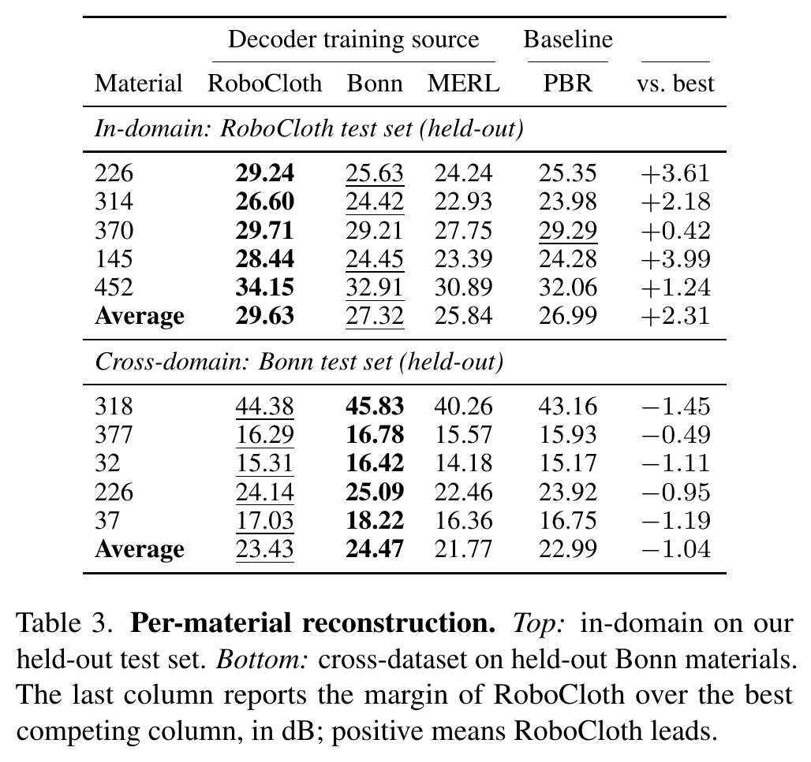
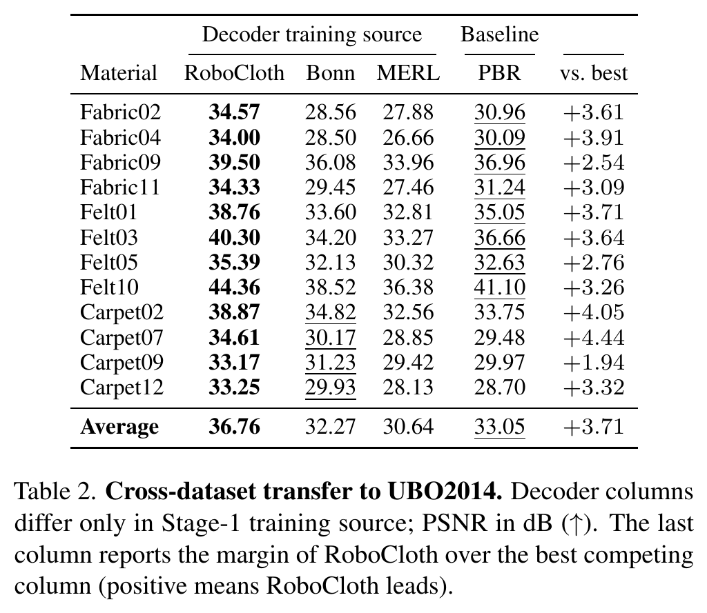
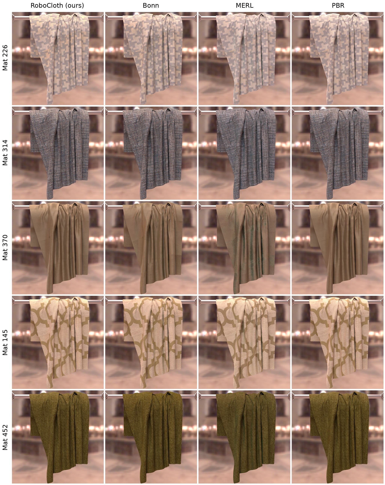
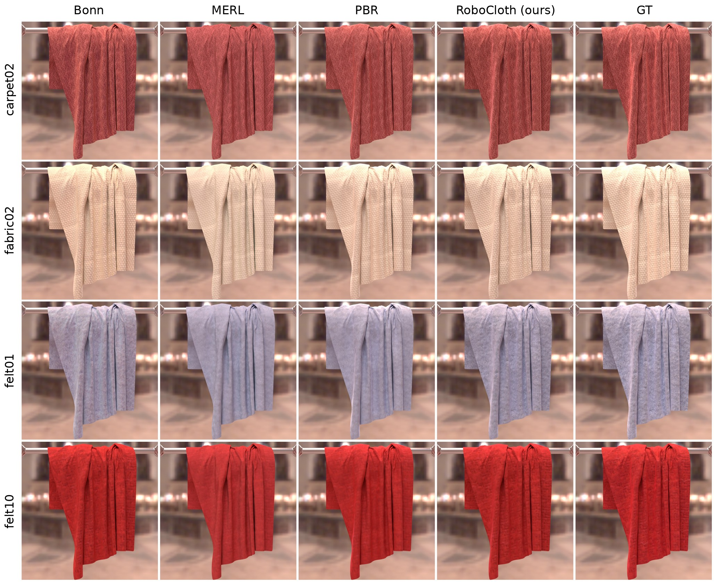

# Reproducing the paper

Every table and figure, with the command that reproduces it. Notation:
`DATA_ROOT` = RoboCloth capture data (download scripts in `scripts/`),
`CKPTS` = the [koalapenguin/RoboCloth-assets](https://huggingface.co/datasets/koalapenguin/RoboCloth-assets)
bundle (checkpoints and render assets — the README calls the same directory
`ROBOCLOTH_CKPTS`). The comparison datasets (MERL, UBO2014, Bonn) are **not**
mirrored on Hugging Face; download them from their original sources with the
scripts under `scripts/comparisons/` ([below](#comparison-datasets-merl-ubo2014-bonn)).
Environments: see the README (rendering) and
[optimize_new_material.md](optimize_new_material.md) (training); the UBO2014
experiments additionally need
`pip install Cython && pip install btf_extractor==1.7.0 --no-build-isolation`.
Use absolute values for `DATA_ROOT`, `CKPTS`, `CKPT_ROOT`, and `OUTPUT_ROOT`;
the launch scripts change working directories internally.

## Tables

| Paper table | Command |
|---|---|
| Table 3, top block — per-material PSNR on our test set (226, 314, 370, 145, 452) | `DATA_ROOT=... OUTPUT_ROOT=... CKPT_ROOT=$CKPTS/checkpoints/stage2/RoboCloth bash scripts/run_table_ours.sh` |
| Table 2 — cross-dataset transfer to UBO2014 (12 materials) | `DATA_ROOT=$EXT_ROOT/UBO2014 OUTPUT_ROOT=... CKPT_ROOT=$CKPTS/checkpoints/stage2/UBO bash scripts/comparisons/run_table_ubo.sh` (`$EXT_ROOT` = where `scripts/comparisons/download_ubo2014.sh` put the BTFs) |
| Table 3, bottom block — per-material PSNR on the Bonn test set (318, 377, 32, 226, 37) | released checkpoints under `$CKPTS/checkpoints/stage2/Bonn` (trained with `scripts/comparisons/train_stage2_bonn.sh`); the Bonn data download and the Bonn table driver are described in [bonn.md](bonn.md). Metric = per-image poly/gray-weighted PSNR from the validation logs |

The two drivers (and the Bonn driver `scripts/comparisons/run_table_bonn.sh`,
described in [bonn.md](bonn.md)) re-evaluate every released checkpoint on its
held-out split with the trainer's own validation step, print the reproduced
number next to the paper value with a PASS/FAIL verdict per cell, and exit
non-zero unless every cell is within `TOLERANCE_DB` of the paper (default
0.05 dB). They save one result JSON per cell under
`$OUTPUT_ROOT/eval_results*/` and the same GT/prediction view renders the
trainer saves during validation.

### Running the table drivers

```bash
export CKPTS=/absolute/path/to/robocloth-checkpoints
export DATA_ROOT=/absolute/path/to/DATA_ROOT
export OUTPUT_ROOT=/absolute/path/to/repro-output

# Table 3, top block: the released stage-2 checkpoints + the dense capture
# data of the five test materials (~9 GB per material)
hf download koalapenguin/RoboCloth-assets --repo-type dataset \
    --include "checkpoints/stage2/RoboCloth/*" --local-dir "$CKPTS"
for m in 226 314 370 145 452; do bash scripts/download_material.sh "$m" "$DATA_ROOT"; done
DATA_ROOT="$DATA_ROOT" OUTPUT_ROOT="$OUTPUT_ROOT" \
CKPT_ROOT="$CKPTS/checkpoints/stage2/RoboCloth" bash scripts/run_table_ours.sh

# Table 2: the UBO2014 checkpoints from the bundle, the BTFs from the BTFDBB
export EXT_ROOT=/absolute/path/to/comparison-datasets
hf download koalapenguin/RoboCloth-assets --repo-type dataset \
    --include "checkpoints/stage2/UBO/*" --local-dir "$CKPTS"
bash scripts/comparisons/download_ubo2014.sh "$EXT_ROOT"
DATA_ROOT="$EXT_ROOT/UBO2014" OUTPUT_ROOT="$OUTPUT_ROOT" \
CKPT_ROOT="$CKPTS/checkpoints/stage2/UBO" bash scripts/comparisons/run_table_ubo.sh

# a single cell (the one verified below)
MATERIALS=145 MODELS=Ours DATA_ROOT="$DATA_ROOT" OUTPUT_ROOT="$OUTPUT_ROOT" \
CKPT_ROOT="$CKPTS/checkpoints/stage2/RoboCloth" bash scripts/run_table_ours.sh
```

Both drivers take the same environment variables:

| Variable | Default | Meaning |
|---|---|---|
| `DATA_ROOT` | required | `run_table_ours.sh`: the capture-data root holding one `<mat>/` folder per test material plus the dataset-level `emitter_calibration.json`. `run_table_ubo.sh`: the folder with the UBO2014 `.btf` files (`$EXT_ROOT/UBO2014`, from `scripts/comparisons/download_ubo2014.sh`). Must be an existing directory. |
| `CKPT_ROOT` | required | `$CKPTS/checkpoints/stage2/RoboCloth` or `$CKPTS/checkpoints/stage2/UBO`. Layout `<mat>/{Ours,Bonn,MERL,PBR}_epoch<N>.ckpt` — exactly one file per material and model. |
| `OUTPUT_ROOT` | `outputs/milestone3` (ours) / `outputs/full_experiments` (UBO), under the repository | Results in `$OUTPUT_ROOT/eval_results/<mat>_<model>.json` resp. `$OUTPUT_ROOT/eval_results_ubo/<mat>_<model>.json`, plus one experiment folder per cell (`Eval_Ours<mat>_<model>/`, `Eval_UBO_<mat>_<model>/`) with the CSV-logger `metrics.csv` and the saved views (`images/gt_view_<i>_0.png`, `images/result_view_<i>_0_psnr<PSNR>.png`). |
| `MATERIALS`, `MODELS` | the whole table | Space-separated subsets, e.g. `MATERIALS="145 226" MODELS="Ours"`. Only materials and models that have a paper value are accepted. |
| `TOLERANCE_DB` | `0.05` | Maximum accepted `\|repro − paper\|` per cell. The average row gets 0.01 dB extra slack because the paper's averages are means of unrounded values printed to two decimals. |
| `FORCE` | `0` | `1` re-evaluates every cell and ignores existing results. |
| `ALLOW_MISSING` | `0` | `1` reports missing/ambiguous checkpoints and evaluates the remaining cells anyway; those cells are printed as `MISSING` and the run still exits non-zero. |
| `ROBOCLOTH_PYTHON` | `python` | Interpreter for the evaluators and the collector. The generic `PYTHON` variable is deliberately ignored. |

The per-cell evaluators also honour `SAVE_ALL_VIEWS=1` (`eval_stage2.sh`
only: save every held-out view instead of the first 20), `CKPT_SHA256=1`
(also record and compare the checkpoint's sha256) and `EXP_NAME`.

**What one run does.**

1. *Checkpoint check, before anything is evaluated.* Every
   `$CKPT_ROOT/<mat>/<model>_epoch*.ckpt` of the requested cells is resolved
   first. A missing or ambiguous (more than one match) checkpoint is
   reported for every offending cell and the run aborts with exit 4 —
   unless `ALLOW_MISSING=1`.
2. *Per cell: reuse or re-evaluate.* An existing `<mat>_<model>.json` is
   reused only if `collect_eval_results.py --reuse-check` accepts it: it
   must carry a `val_psnr` and checkpoint provenance; its recorded
   `material`, `model`, `experiment` (`eval_stage2` / `eval_stage2_pbr`,
   `eval_ubo` / `eval_ubo_pbr`), `dataset_folder` (compared by real path)
   and `overrides` (must be empty) must match this cell; and its recorded
   checkpoint path, size and mtime (`ckpt_abs`, `ckpt_size`,
   `ckpt_mtime_ns`, plus sha256 under `CKPT_SHA256=1`) must match the file
   on disk. Anything else — no previous result, a JSON written before the
   provenance fields existed, a moved/replaced/touched checkpoint, another
   configuration — is re-evaluated; the reason is printed, and the
   superseded JSON is kept aside as `<mat>_<model>.json.prev` so that only
   this run's own output can be accepted for the cell. `FORCE=1` skips the
   check. The evaluator (`scripts/eval_stage2.sh <mat> <ckpt> <model>`,
   resp. `scripts/comparisons/eval_stage2_ubo.sh`) then runs the exact
   training-time validation over the full held-out split. If it fails, the
   run stops with exit 5 and prints the failing command so it can be
   re-run by hand; if it exits 0 but leaves no JSON that describes this
   checkpoint, that is exit 5 as well.
3. *Collect.* The collector prints the table below and exits 0 only if
   every expected cell is present and within tolerance.

**The result JSON.** `collect_eval_results.write_result` writes each
`<mat>_<model>.json` atomically (`.json.tmp` + rename) with:

| Field | Content |
|---|---|
| `material`, `model`, `ckpt` | the cell and the checkpoint path as given |
| `val_psnr`, `val_loss` | the paper metric (`val/psnr`, averaged over all held-out views) and the log-relative validation loss |
| `ckpt_abs`, `ckpt_size`, `ckpt_mtime_ns`, `ckpt_mtime` (+ `ckpt_sha256`) | checkpoint fingerprint that the reuse check compares with the file on disk |
| `git_head`, `git_dirty` | commit of this repository that produced the number, and whether the tree had uncommitted changes |
| `timestamp`, `hostname`, `provenance_version` | when and where it was written (UTC); schema version 1 |
| `experiment`, `dataset_folder` (+ `btf_path` for UBO), `exp_name`, `valid_num` (ours only), `metrics_csv`, `overrides` | the configuration identifiers the reuse check demands, and which `metrics.csv` the number was parsed from (only a file written by *this* run is ever read) |

The file records your machine name and absolute paths — bear that in mind
before sharing result folders.

**Exit codes** (both drivers):

| Exit | Meaning |
|---|---|
| 0 | PASS — every expected cell reproduced within `TOLERANCE_DB` |
| 2 | bad environment or arguments: `DATA_ROOT` is not a directory, the interpreter is not executable, or a `MATERIALS` / `MODELS` entry has no paper value |
| 4 | a checkpoint is missing or ambiguous (all cells are checked before any evaluation starts; every offending cell is listed) |
| 5 | an evaluation failed or did not leave a valid result JSON for its checkpoint; the failing command is printed and the run stops there |
| 6 | an expected table cell has no result (including cells skipped under `ALLOW_MISSING=1`) |
| 7 | a cell differs from the paper by more than `TOLERANCE_DB` (7 takes precedence over 6) |

The evaluators fail closed on their own: exit 2 = interpreter not
executable, 4 = checkpoint not found, 3 = `train.py` exited 0 but wrote no
new `metrics.csv` (files left by earlier runs under the same experiment
name are never read), 1 = no `val/psnr` in it; a non-zero `train.py` exit
is passed through. No JSON is written in any of these cases; the driver
reports all of them as exit 5.

A passing single-cell run ends like this (paths shortened):

```
[run_table] evaluating material 145 / Ours: no previous result (.../eval_results/145_Ours.json)
...
[eval_stage2] material 145 / Ours: val/psnr = 28.44 dB (val/loss = 0.1165)  ->  .../eval_results/145_Ours.json

=== Per-material reconstruction PSNR (dB) — our held-out test set ===
results: .../eval_results
tolerance: |repro - paper| <= 0.05 dB per cell (average row: <= 0.06 dB, incl. rounding slack of the paper's 2-decimal averages)
material |                      Ours |                      Bonn |                      MERL |                       PBR
         |  repro/paper/diff  status |  repro/paper/diff  status |  repro/paper/diff  status |  repro/paper/diff  status
------------------------------------------------------------------------------------------------------------------------
     226 |    --/29.24/   --     n/a |    --/25.63/   --     n/a |    --/24.24/   --     n/a |    --/25.35/   --     n/a
     ...
     145 | 28.44/28.44/+0.00    PASS |    --/24.45/   --     n/a |    --/23.39/   --     n/a |    --/24.28/   --     n/a
     ...
 average |    --/29.63/   --   (1/5) |    --/27.32/   --   (0/5) |    --/25.84/   --   (0/5) |    --/26.99/   --   (0/5)

cells: 1 expected, 1 present, 0 missing; 1 PASS, 0 FAIL (tolerance 0.05 dB)
RESULT: PASS — all expected cells within tolerance
[run_table] PASS: all 1 cells reproduced within 0.05 dB of the paper
```

A second invocation prints `[run_table] reuse .../145_Ours.json: checkpoint
unchanged (path/size/mtime match); val/psnr 28.44 dB from <timestamp>` and
skips straight to the table.

**Runtime.** Each evaluation renders the full held-out split — 117 views
at 16 spp for material 145, the 4,560 held-out view–light combinations of a
UBO2014 material — roughly 10–30 min per RoboCloth cell on a modern GPU;
Table 3's top block is 20 evaluations, Table 2 is 48. A run can be
interrupted and restarted: finished cells are reused. Hardware: one GPU
(48 GB is enough) and a large-memory host, because the stage-2 loader
preloads the material's HDR views (see the hardware note in
[optimize_new_material.md](optimize_new_material.md)).

The fail-closed behaviour above — every exit code, the reuse/stale rules,
the `.prev` handling — is unit-tested without a GPU, data or checkpoints:
`python -B -m unittest discover -s tests/repro_drivers -v`.

### Expected results

The numbers the drivers check against — Table 3 of the paper (PSNR in dB
on the held-out views; columns = the dataset the stage-1 decoder was
trained on, plus the analytic Disney-PBR baseline). The same values are
hard-coded in `scripts/collect_eval_results.py` (`PAPER`, `PAPER_AVG`) and
`scripts/comparisons/collect_eval_results_ubo.py`.

*In-domain — our held-out test set* (`scripts/run_table_ours.sh`):

| Material | RoboCloth | Bonn | MERL | PBR |
|---|---|---|---|---|
| 226 | 29.24 | 25.63 | 24.24 | 25.35 |
| 314 | 26.60 | 24.42 | 22.93 | 23.98 |
| 370 | 29.71 | 29.21 | 27.75 | 29.29 |
| 145 | 28.44 | 24.45 | 23.39 | 24.28 |
| 452 | 34.15 | 32.91 | 30.89 | 32.06 |
| **Average** | **29.63** | **27.32** | **25.84** | **26.99** |

*Cross-domain — Bonn test set* (see [bonn.md](bonn.md)):

| Material | RoboCloth | Bonn | MERL | PBR |
|---|---|---|---|---|
| 318 | 44.38 | 45.83 | 40.26 | 43.16 |
| 377 | 16.29 | 16.78 | 15.57 | 15.93 |
| 32 | 15.31 | 16.42 | 14.18 | 15.17 |
| 226 | 24.14 | 25.09 | 22.46 | 23.92 |
| 37 | 17.03 | 18.22 | 16.36 | 16.75 |
| **Average** | **23.43** | **24.47** | **21.77** | **22.99** |



*Table 3 of the paper, as printed.*

Table 2 of the paper — cross-dataset transfer to 12 held-out UBO2014
materials (`scripts/comparisons/run_table_ubo.sh`):

| Material | RoboCloth | Bonn | MERL | PBR |
|---|---|---|---|---|
| fabric02 | 34.57 | 28.56 | 27.88 | 30.96 |
| fabric04 | 34.00 | 28.50 | 26.66 | 30.09 |
| fabric09 | 39.50 | 36.08 | 33.96 | 36.96 |
| fabric11 | 34.33 | 29.45 | 27.46 | 31.24 |
| felt01 | 38.76 | 33.60 | 32.81 | 35.05 |
| felt03 | 40.30 | 34.20 | 33.27 | 36.66 |
| felt05 | 35.39 | 32.13 | 30.32 | 32.63 |
| felt10 | 44.36 | 38.52 | 36.38 | 41.10 |
| carpet02 | 38.87 | 34.82 | 32.56 | 33.75 |
| carpet07 | 34.61 | 30.17 | 28.85 | 29.48 |
| carpet09 | 33.17 | 31.23 | 29.42 | 29.97 |
| carpet12 | 33.25 | 29.93 | 28.13 | 28.70 |
| **Average** | **36.76** | **32.27** | **30.64** | **33.05** |



*Table 2 of the paper, as printed.*

The qualitative figures are renders of the same checkpoints in the bundled
`cloth_on_bar` scene ([recipes below](#qualitative-figures-renders-of-the-checkpoints)):



*Paper Fig. 10 (supplementary): our five held-out materials (rows 226, 314,
370, 145, 452) reconstructed with the decoder trained on RoboCloth, Bonn or
MERL and with the PBR baseline (columns). There is no ground-truth render
for our own captures; the numbers are Table 3 above.*



*Paper Fig. 4 (four-row version): UBO2014 materials carpet02, fabric02,
felt01 and felt10 relit with each decoder (columns Bonn, MERL, PBR,
RoboCloth) next to the ground-truth BTF render (GT); the paper prints three
of these rows with zoom insets.*

## Trainings behind the tables

All hyperparameters live in `configs/experiment/*.yaml`; scripts only take
paths. `MODEL=Ours|Bonn|MERL|PBR` selects the frozen-decoder source or the
Disney baseline (UBO-from-MERL applies the paper's β-init 0.1 automatically).

| Run | Command |
|---|---|
| Stage-1 decoder on RoboCloth / Bonn / MERL | `scripts/train_stage1.sh`, `scripts/comparisons/train_stage1_{bonn,merl}.sh` |
| Stage-2 on our materials | `scripts/train_stage2.sh <mat>` |
| Stage-2 on Bonn / UBO2014 test sets | `scripts/comparisons/train_stage2_{bonn,ubo}.sh <mat>` |
| Dataset-size ablation (100/300) | `TRAINING_LIST=$DATA_ROOT/training_list_{100,300}.txt bash scripts/train_stage1.sh` |
| Grazing-angle ablation | `bash scripts/train_stage1.sh model.grazing_mode={zero_exact,near_zero_brdf,contribution_decay}` |

The released stage-1 priors are `$CKPTS/checkpoints/stage1/{Ours,Bonn,MERL}.ckpt`;
stage 2 loads only their decoder (`material.decoder.*`, 10 tensors) and
logs `=> loaded 10 tensors from ... (scope: material.decoder.*)`.
Bonn (UBOFAB19) data — the download scripts
`scripts/comparisons/bonn_data/get_UBOFAB19_*.sh`,
`scripts/comparisons/generate_bonn_metadata.py`, and the Bonn evaluation —
is covered in [bonn.md](bonn.md). MERL and UBO2014 come from their original
sources, see the next section.

## Comparison datasets (MERL, UBO2014, Bonn)

None of the three comparison datasets is redistributed by us — they used to be
mirrored under `datasets/` in our Hugging Face bundle and are not any more.
Download them from their original sources; the scripts below place them in the
layout the loaders and drivers expect. `$EXT_ROOT` is any absolute directory.

| Dataset | Script | Result | Size |
|---|---|---|---|
| MERL BRDF database (the `MERL` decoder column) | `bash scripts/comparisons/download_merl.sh "$EXT_ROOT"` | `$EXT_ROOT/MERL/brdfs/<material>.binary` (100 files) | 1.25 GB archive, ~3.3 GB extracted |
| UBO2014 BTF (Table 2, 12 held-out materials) | `bash scripts/comparisons/download_ubo2014.sh "$EXT_ROOT"` | `$EXT_ROOT/UBO2014/<material>_W400xH400_L151xV151.btf` (12 files) | ~1.0 GB |
| Bonn / UBOFAB19 (Table 3, bottom block) | `scripts/comparisons/bonn_data/get_UBOFAB19_*.sh` — see [bonn.md](bonn.md) §1 | one flat folder per split | 57 GB (val) / 180 GB (train) |

Both new scripts take an **absolute** `DATA_ROOT` as their first argument, are
resumable, fail closed on any size or count mismatch, and accept
`--verify /absolute/path/to/checksums.json` to additionally compare every file's
sha256 against a reference list — the digests of the copies that used to be
mirrored on Hugging Face, if you have that list and want to confirm byte
identity with what the paper used.

**MERL.** The archive is the [MERL BRDF Database on Zenodo](https://zenodo.org/records/8101681)
(DOI [10.5281/zenodo.8101680](https://doi.org/10.5281/zenodo.8101680), license
CC-BY-SA-4.0): one `BRDFDatabase.zip` holding `BRDFDatabase/brdfs/*.binary`.
The script checks the archive's published md5, extracts the 100 `.binary`
files, and checks that each is 34,992,012 bytes. **No preprocessing** — the
loader (`training/datasets/merl.py`, via `MERLInterface`) reads the `.binary`
files directly. Point stage-1 training at the `brdfs` folder:

```bash
DATA_ROOT="$EXT_ROOT/MERL/brdfs" OUTPUT_ROOT="$OUTPUT_ROOT" \
    bash scripts/comparisons/train_stage1_merl.sh
```

**UBO2014.** The 12 held-out BTFs (carpet02, carpet07, carpet09, carpet12,
fabric02, fabric04, fabric09, fabric11, felt01, felt03, felt05, felt10) come
from the University of Bonn BTF Database (BTFDBB),
`https://cg.cs.uni-bonn.de/btf/UBO2014/<category>/<material>_W400xH400_L151xV151.btf`
— that direct pattern was verified working (HTTP 200, and the downloaded
`felt10` matched the sha256 of the copy the paper used). It is not, however, a
URL the project documents as stable: if the probe fails, the script prints the
exact filenames, the target folder and the
[UBO2014 download page](https://cg.cs.uni-bonn.de/en/projects/btfdbb/download/ubo2014/)
and exits 2, so fetch them by hand in that case. The download page is
JavaScript-only and its licence text could not be quoted here — **read the
BTFDBB terms of use on that page** before using the data, and cite the dataset
as the BTFDBB asks. **Preprocessing:** none beyond installing the reader,
`pip install Cython && pip install btf_extractor==1.7.0 --no-build-isolation`;
`training/datasets/ubo.py` decodes the `.btf` files on the fly.

**Bonn (UBOFAB19)** has its own download scripts and its own guide:
[bonn.md](bonn.md) §1–§3 (download lists, expected folder layout, and the
`bonn_point_metadata.json` step, which *is* required before training or
evaluation).

## Qualitative figures (renders of the checkpoints)

All figures use the bundled `rendering/examples/cloth_on_bar` scene — only
`materials.json` changes. The paper grids render at
`render.spp=512 render.width=2048 render.height=2048`.

**Our materials** (RoboCloth columns; supp. figure rows 226/314/370/145/452):

```json
{ "checkpoint_root": "/absolute/path/to/CKPTS/checkpoints/stage2/RoboCloth",
  "assignments": { "cloth": {"material": "145"} } }
```

**UBO2014 checkpoints** (cross-dataset figure; materials carpet02...felt10) —
select the decoder column via the checkpoint filename and set the UBO wrapper:

```json
{ "checkpoint_root": "/absolute/path/to/CKPTS/checkpoints/stage2/UBO",
  "assignments": { "cloth": {
      "ckpt": "felt01/Bonn_epoch60.ckpt",
      "material_type": "UBOLatentBRDF",
      "apply_cosine_at_eval": true } } }
```

**Bonn checkpoints**: as above with `"material_type": "BonnLatentBRDF"`,
`"apply_cosine_at_eval": true`, and checkpoints from
`checkpoints/stage2/Bonn/<mat>/`. The Bonn wrapper additionally reads the
per-material latent-grid shape from `bonn_point_metadata.json`
(`rendering/configs/material/BonnLatentBRDF.yaml` points at the Bonn_val
folder — see [bonn.md](bonn.md) for the data download).

**Disney-PBR baselines**: `"material_type": "LearnablePBRTexturedModel"`
for `..._PBR` checkpoints on our materials
(`"UBOPBRLatentBRDF"`/`"BonnPBRLatentBRDF"` + `apply_cosine_at_eval` for the
UBO/Bonn PBR checkpoints).

**Teaser**: `rendering/examples/teaser` as shipped (README, bundled-examples
section).

## Verification status of this repository

Everything in this section was run with the code in this repository
against the released checkpoints and data. "Verified" means the number was
reproduced here; nothing else in the paper should be cited as reproduced by
this repository yet.

**Verified**

| What | Result |
|---|---|
| Table 3, material 145 / RoboCloth decoder (`145/Ours_epoch112.ckpt`), all 117 held-out views | **28.442256927490234 dB** — the paper's 28.44 at full float precision. Reproduced again on 2026-09-01 through the hardened drivers (`MATERIALS=145 MODELS=Ours bash scripts/run_table_ours.sh`): PASS within 0.05 dB; a second invocation reused the result (checkpoint unchanged); a checkpoint root without the Bonn checkpoint was refused with exit 4 before any evaluation, and evaluated the remaining cell under `ALLOW_MISSING=1` (exit 6, cell marked `MISSING`); a fresh copy of the checkpoint was re-evaluated from scratch and passed again. |
| Table 2, UBO2014 felt01 / Bonn decoder (`felt01/Bonn_epoch60.ckpt`), all 4,560 held-out view–light combinations | **33.596622467041016 dB** — rounds to the paper's 33.60. Reproduced through `MATERIALS=felt01 MODELS=Bonn bash scripts/comparisons/run_table_ubo.sh` (PASS; the result was reused on the next invocation). |
| Rendering | the bundled `cloth_on_bar` scene at 2048², 512 spp (the README figure), and a custom scene with two materials. |
| Stage-1 data path | `scripts/ci_stage1_datapath.sh` from an empty directory: download of materials 145 + 226 with the real downloader, structural validation of every file stage 1 opens, one stage-1 epoch. |
| Stage-2 warm start | from each released stage-1 prior (`checkpoints/stage1/{Ours,Bonn,MERL}.ckpt`) loads exactly the 10 decoder tensors (`=> loaded 10 tensors ... (scope: material.decoder.*)`). |

**Not verified here** (do not cite as reproduced by this repository):

* the other 19 cells of Table 3's top block and the other 47 cells of
  Table 2;
* all Bonn cells (Table 3, bottom block);
* the 100/300-material and grazing-angle ablations;
* the full qualitative grids (Fig. 4, Fig. 10) — only the single
  `cloth_on_bar` render above has been re-rendered;
* end-to-end calibration and reconstruction from raw capture. The
  reconstruction code path was shown byte-identical on one material's raw
  session (observation tensor, points and debayered HDR identical; poses
  within 1e-13 mm), but no numbers derived from it are claimed;
  [capture_fixture.md](capture_fixture.md) runs the software path on a
  small fixture without comparing numbers.

**Regression checks against the original experiment code** (how the
restructure was validated — code-path parity, not paper numbers):

* released-checkpoint evaluation: PSNR identical at full float precision
  (the two cells above);
* training: bit-identical loss trajectories on seeded smoke runs (stage 1),
  clean convergence on stage 2; experiment configs resolve identically to
  the original run commands;
* rendering: the unified renderer matches the original branch renders at
  the Monte-Carlo noise floor on both bundled examples.
