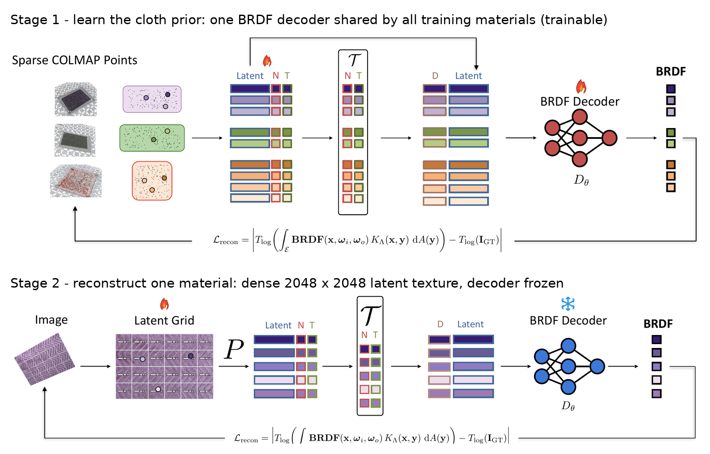

# Train the shared BRDF decoder (stage 1)



Train the material prior — one MLP decoder + per-point latent tables —
from scratch on the RoboCloth training corpus. You only need this to change
the prior itself; for everything else the released
`checkpoints/stage1/Ours.ckpt` is the result of exactly this run.

## 1. Environment

Same as [optimize_new_material.md](optimize_new_material.md) §1.

## 2. Download the stage-1 training set

Stage 1 reads only the sparse observation tensors, not the HDR images —
use the sparse download (~490 GB instead of ~3.5 TB):

```bash
export DATA_ROOT=/absolute/path/to/DATA_ROOT
export OUTPUT_ROOT=/absolute/path/to/robocloth-output
bash scripts/download_dataset_stage1.sh "$DATA_ROOT"
```

(For the complete dataset including all HDR views:
`bash scripts/download_dataset_full.sh "$DATA_ROOT"`.) Both downloaders use
the explicit numeric material IDs 0–499 by default. For a restricted test,
set a whitespace-separated numeric subset such as
`ROBOCLOTH_MATERIALS="145 226"`.

## 3. Train

```bash
DATA_ROOT="$DATA_ROOT" OUTPUT_ROOT="$OUTPUT_ROOT" bash scripts/train_stage1.sh
```

Hyperparameters live in `configs/experiment/stage1.yaml` (paper defaults:
5×10⁵ rays/batch, 8-bit Adam, log-relative loss, grazing-angle
regularization, 100 epochs — the paper checkpoint is epoch 60). The training
list defaults to all ~400 training materials
(`$DATA_ROOT/training_list_500.txt`); pass `TRAINING_LIST=` for the 100/300
ablation subsets or your own list.

Hardware: a single large GPU (paper: 80 GB) and ~1.3 GB host RAM per
material in the list (~500 GB for the full corpus).

Output: `$OUTPUT_ROOT/stage1_prior/training/model_0.20_0.20/last.ckpt`
(`EXP_NAME` renames the `stage1_prior` folder) — use it as `STAGE1_CKPT` in
stage 2.

*Quick sanity check* (~20 min): write ~5 material ids to a file at an absolute
path and run
`TRAINING_LIST=/absolute/path/to/five_materials.txt bash scripts/train_stage1.sh model.trainer.max_epochs=3 model.trainer.limit_train_batches=300`
— the training loss should drop steeply within the first epoch.
